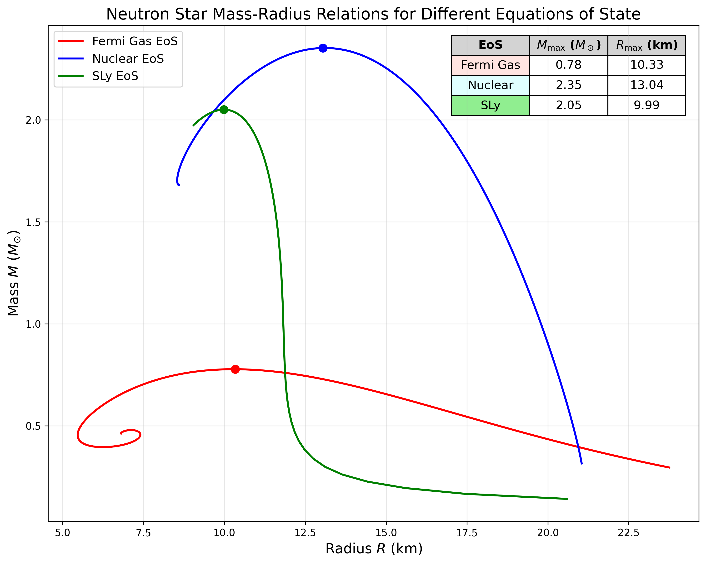
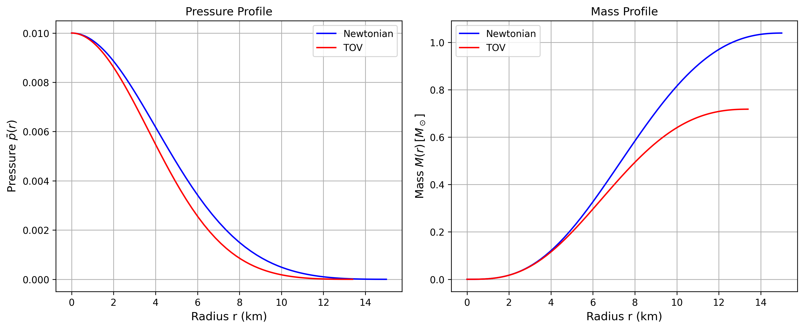

# Neutron Star Structure Solver

### PH755: Computational Physics Project - NITK, India

This project involves the numerical solution of the Tolman-Oppenheimer-Volkoff (TOV) equations for modeling the structure of neutron stars under the framework of General Relativity. The primary objective is to compute the mass-radius relationship for various Equations of State (EoS) that describe the behavior of matter at supranuclear densities.

### Code Descriptions

This repository contains several Python scripts, each designed for a specific modeling task.

* **`src/compare_eos_models.py`**
    This is a comprehensive script that integrates the TOV equations for three distinct Equations of State: a hybrid Fermi Gas model, a simplified nuclear interaction model, and the realistic SLy EoS. It generates and plots the mass-radius curves for all three on a single graph for direct comparative analysis.

* **`src/eos_SLy.py`**
    This solver is dedicated to the tabulated, realistic SLy (Sly, Haensel, and Douchin) Equation of State. It utilizes cubic spline interpolation to generate a continuous function from the discrete data points provided in `data/SLy.txt`, enabling an accurate integration of the stellar structure.

* **`src/mass_radius.py`**
    This script calculates the mass-radius relation using a simplified hybrid Fermi Gas model. This EoS combines the non-relativistic and ultra-relativistic limits for degenerate fermion matter to provide a foundational model of a neutron star's composition.

* **`src/tov_solver_nuclear.py`**
    This script implements a solver for a simplified nuclear EoS where the energy density is parameterized as being proportional to the square root of the pressure. This model represents a basic approximation for strong nucleon-nucleon interactions within the stellar core.

* **`src/ns_structure.py`**
    This is a comparative script that calculates the internal structure (pressure and mass profiles vs. radius) for a single star. It solves for the structure using both the full General Relativistic (TOV) framework and the classical Newtonian model of hydrostatic equilibrium, visually demonstrating the significant effects of General Relativity on compact objects.

### Presentation

For a detailed theoretical background on the TOV equations, the implemented Equations of State, and a full discussion of the results, please refer to the `PH755_Seminar_Presentation.pdf` file located in the `/presentation` directory.

### Results

The primary graphical outputs are the mass-radius (M-R) curves for the different models.

**Mass-Radius Curve Comparison**

**Comparison of GR vs. Newtonian Structure**

---

This project was completed as part of the assessment for the **PH755: Computational Physics** course at the **National Institute of Technology Karnataka (NITK), Surathkal**.
